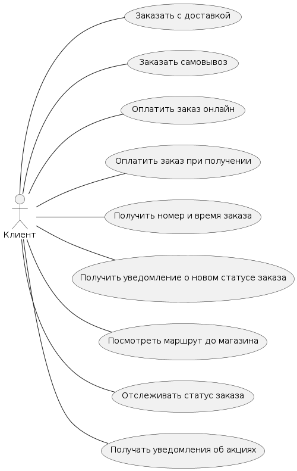
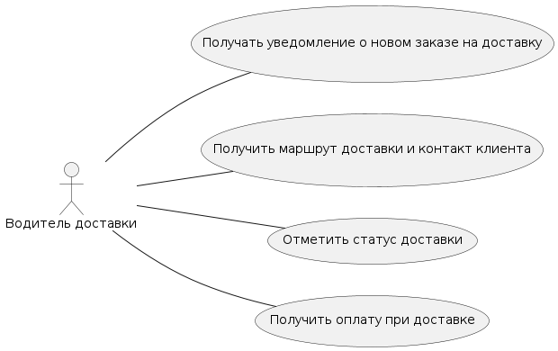
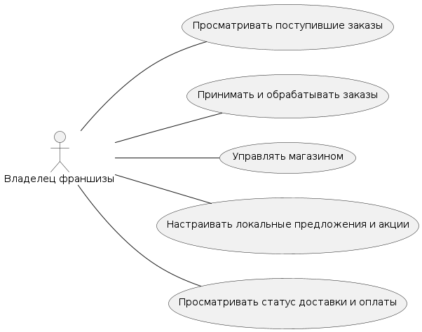

# Лабораторная работа №1

**Тема**: Формулирование требований к программной системе

**Цель работы**: Научиться анализировать поставленную задачу, формулировать функциональные и нефункциональные требования к проектируемой системе.

## Перечень заинтересованных лиц (стейкхолдеров)

1. **Клиенты (Покупатели)**
    - Оформляют заказы на сэндвичи через сайт или мобильное приложение.
    - Получают информацию о времени готовности заказа и маршруте до магазина.
    - Получают оповещения о специальных предложениях и акциях.
    - Оплачивают заказы онлайн или лично.

2. **Владельцы франшиз (Локальные собственники магазинов)**
    - Управляют своими магазинами и принимают заказы.
    - Настраивают локальные предложения и акции.
    - Получают информацию о поступивших заказах, доставке и оплате.

3. **Водители доставки**
    - Получают уведомления о необходимости доставить заказ клиенту.
    - Отмечают статус доставки.
    - Взаимодействуют с системой для получения данных маршрута и оплаты при доставке.

4. **Сотрудники магазина**
    - Готовят заказы.
    - Отмечают статус готовности заказа.
    - Взаимодействуют с клиентами при выдаче заказа или приеме оплаты.

5. **Материнская компания**
    - Управляет национальными предложениями и акциями.

6. **Поставщики внешних картографических сервисов**
    - Предоставляют API для построения маршрутов и отображения информации о пробках.

7. **Платежные сервисы (эквайринговые провайдеры)**
    - Обеспечивают онлайн-оплату и возвраты средств.

---

## Перечень функциональных требований

1. **Оформление заказа**
    - Клиент может выбрать любые позиции меню и оформить заказ через сайт или мобильное приложение.
    - Система формирует номер заказа и отображает/отправляет информацию о предполагаемом времени выдачи.

2. **Оповещение о готовности заказа**
    - Клиент получает уведомление (push-уведомление / смс) о том, что заказ готов к выдаче или передан в доставку.

3. **Построение маршрута до магазина**
    - Система показывает клиенту оптимальный путь до выбранного магазина с учетом информации о дорожном движении.
    - Клиент может перейти к пути во внешних картографических сервисах (2GIS, Яндекс.Карты).

4. **Управление доставкой заказа**
    - При выборе клиентом доставки заказ автоматически передается ближайшему водителю.
    - Водитель получает маршрут доставки и контакт клиента.
    - Возможность отслеживать статус доставки (например, "Заказ принят", "В доставке", "Доставлен").

5. **Управление специальными предложениями**
    - Публикация национальных ежедневных акций/предложений (централизованно).
    - Владельцы магазинов могут самостоятельно настраивать локальные ежедневные предложения.

6. **Платежи**
    - Возможность оплатить заказ онлайн (банковские карты, мобильные платежи, пр.).
    - Возможность оплаты заказа лично при получении в магазине или при доставке.

---

## Диаграмма вариантов использования

### Клиент

### Водитель

### Сотрудник магазина

### Внешние акторы

### Франчайзии (местный владелец франшизы)

### Материнская компания

---

## Перечень сделанных предположений

1. В описании задания количество пользователей указано "ежедневно".
2. "Национальные ежедневные акции/специальные предложения" - имеется в виду акции, спускаемые сверху компанией держателем франшизи своим франчайзи.
3. "Местные ежедневные акции/специальные предложения" - имеется в виду акции, которые франчайзи сами запускают в своих магазинах.
4. "Доступность мобильных устройств" - имеется в виду, наличие нативного приложения(-ий) для ОС iOS и Android современных версий.
5. "Материнская компания имеет в ближайшем будущем планы по расширению за рубежом." - имеется в виду в т.ч. и расширение в нерусскоязычные страны.

---

## Перечень нефункциональных требований

1. **Поддержка мобильных устройств**
   - Полная доступность функционала с мобильных устройств (нативное приложение)

2. **Расширяемость для выхода на зарубежные рынки**
   - Возможность добавления новых стран, языков, валют.
   - Возможность добавления локальных методов оплаты.
   - Возможность добавления интеграции с локальными провайдерами отправки СМС.
   - Возможность добавления интеграции с локальными провайдерами картографических сервисов.

3. **Доступность**
   - Сервис должен быть доступен 99% времени без учета плановой недоступности.
   - Плановая недоступность с целью тех. обслуживания возможна и всегда должна быть соглосованна с материнской компанией (заказчиком).

4. **Масштабируемость**
   - Сервис может быть масштабирован до нагрузки в миллион пользователей ежедневно.