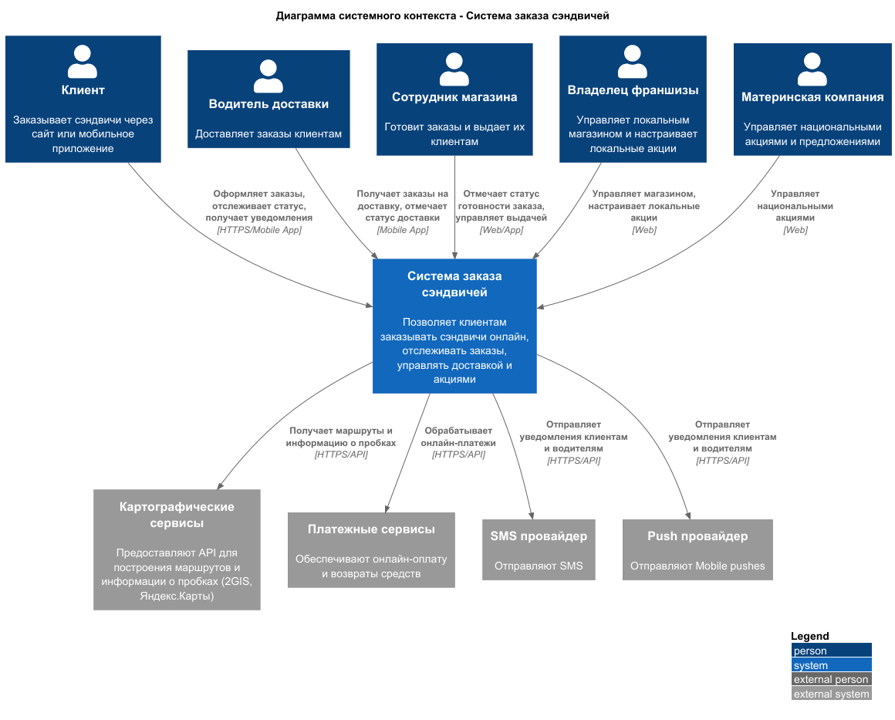
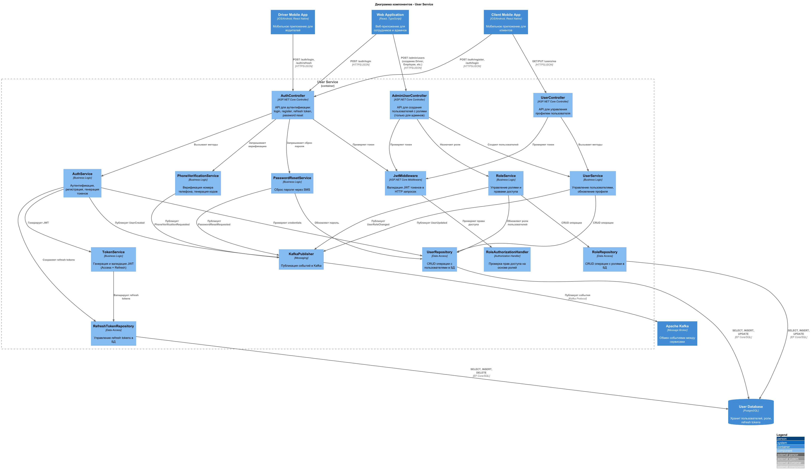
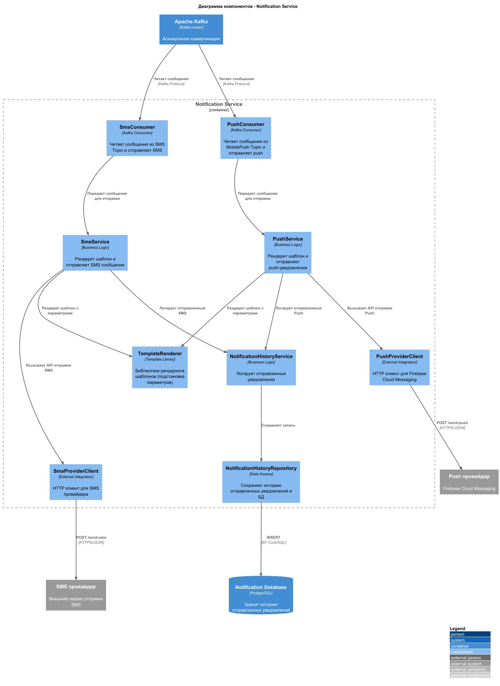

# Лабораторная работа №2

**Тема:** Использование нотации C4 model для проектирования архитектуры программной системы

**Цель работы:** Получить опыт использования графической нотации для фиксации архитектурных решений.

## Диаграмма системного контекста

## Диаграмма контейнеров

### Выбор архитектурного стиля

**Архитектурный стиль:** Service-Oriented Architecture (SOA)

**Обоснование выбора:**

1. **Масштабируемость** - каждый сервис может масштабироваться независимо в зависимости от нагрузки (требование: до миллиона пользователей ежедневно)

2. **Доступность** - изоляция отказов: проблема в одном сервисе не влияет на другие (требование: 99% uptime)

3. **Расширяемость для международного рынка** - легко добавлять новые интеграции (локальные платежные системы, SMS-провайдеры, картографические сервисы)

## Диаграммы компонентов

### User Service

### Notification Service

