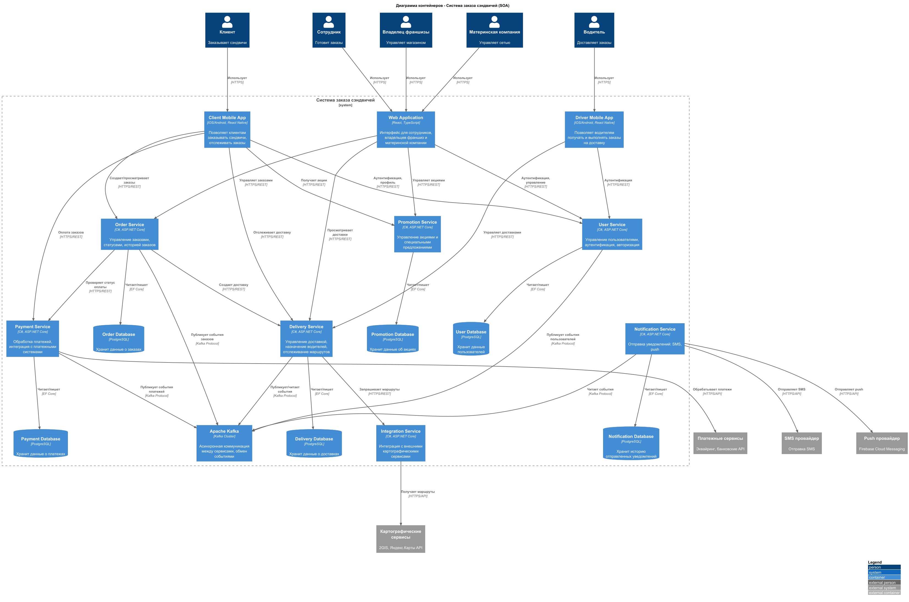
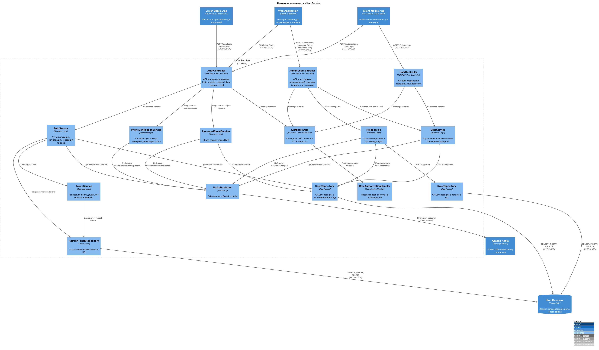
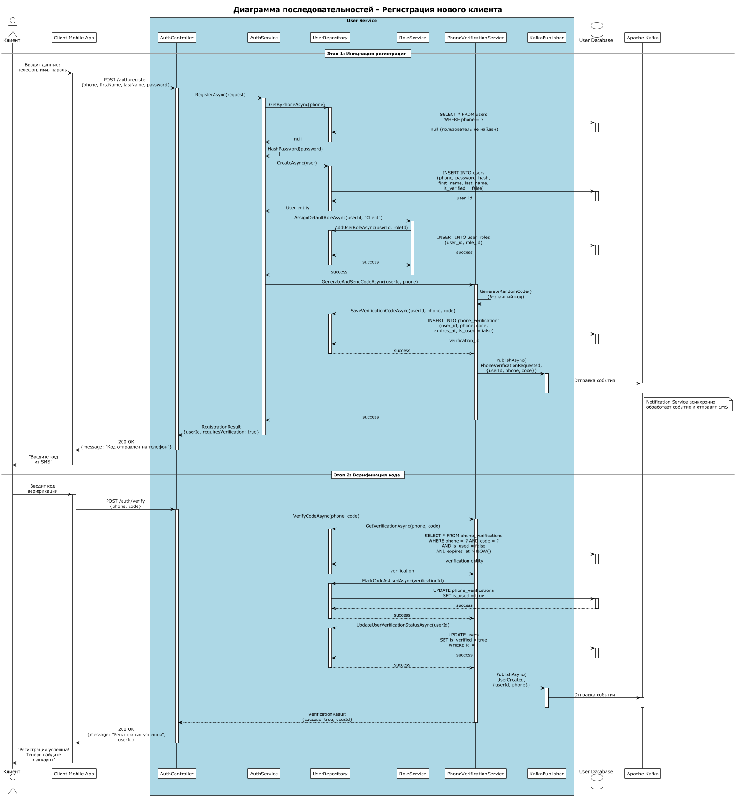
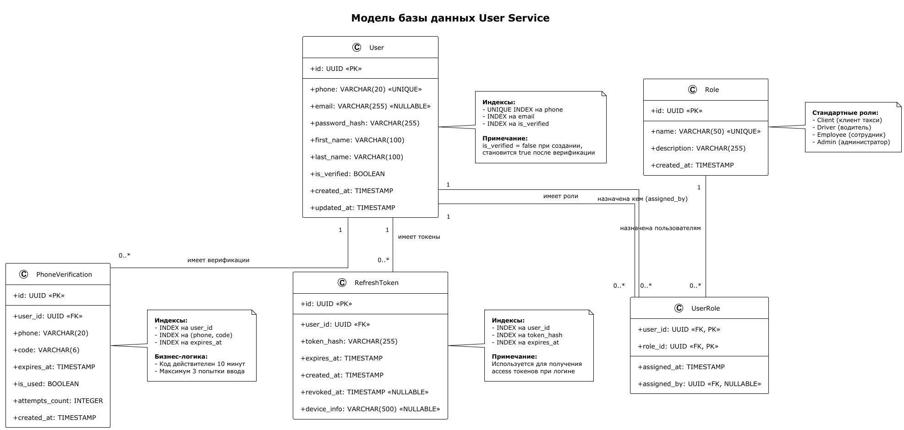

# Лабораторная работа №3

**Тема:** Использование принципов проектирования на уровне методов и классов  
**Цель работы:** Получить опыт проектирования и реализации модулей с использованием принципов KISS, YAGNI, DRY, SOLID и др.

## Диаграмма контейнеров



## Диаграмма компонентов



## Диаграмма последовательностей

Use-case регистрации - в два этапа. Сначала запрашивается код, потом вводится.


## Модель БД



## Применение основных принципов разработки

### KISS (Keep It Simple, Stupid)

**Принцип простоты** — код должен быть максимально простым и понятным, без излишней сложности.

```csharp
// PhoneVerificationService.cs
public class PhoneVerificationService
{
    private readonly Random _random = new Random();

    public string GenerateRandomCode()
    {
        return _random.Next(100000, 999999).ToString();
    }


    public bool IsCodeValid(PhoneVerification verification)
    {
        return !verification.IsUsed
               && verification.ExpiresAt > DateTime.UtcNow
               && verification.AttemptsCount < 3;
    }
}
```

**Применение KISS:** Методы выполняют одну простую задачу без излишних абстракций. `GenerateRandomCode()` генерирует 6-значное число без сложных алгоритмов. `IsCodeValid()` проверяет три простых условия в читаемом виде — код не использован, не истек и не превышен лимит попыток.

### YAGNI (You Aren't Gonna Need It)

**Принцип "Вам это не понадобится"** — не реализовывать функциональность, которая не нужна прямо сейчас.

```csharp
// AuthService.cs
public class AuthService
{
    private readonly IUserRepository _userRepository;
    private readonly IPasswordHasher _passwordHasher;

    public async Task<User> RegisterAsync(RegisterRequest request)
    {
        // Проверяем только то, что нужно сейчас - существует ли пользователь
        var existingUser = await _userRepository.GetByPhoneAsync(request.Phone);
        if (existingUser != null)
            throw new UserAlreadyExistsException();

        // Создаем пользователя с минимальным набором полей
        var user = new User
        {
            Phone = request.Phone,
            PasswordHash = _passwordHasher.HashPassword(request.Password),
            FirstName = request.FirstName,
            LastName = request.LastName,
            IsVerified = false
        };

        return await _userRepository.CreateAsync(user);
    }
}
```

**Применение YAGNI:**
- **Не добавлена** сложная валидация email (его еще нет в системе)
- **Не реализован** механизм множественных попыток регистрации с разными номерами
- **Не создана** система профилей с аватарами, биографией и другими полями "на будущее"
- **Не добавлен** функционал смены номера телефона до верификации

Реализовано только то, что необходимо для базовой регистрации: проверка уникальности телефона, хеширование пароля и сохранение минимального набора данных.

### DRY (Don't Repeat Yourself)

**Принцип "Не повторяйся"** — избегать дублирования кода, выносить общую логику в переиспользуемые компоненты.

```csharp
// BaseRepository.cs - базовый репозиторий для избежания дублирования
public abstract class BaseRepository<T> where T : class
{
    protected readonly DbContext _context;

    protected BaseRepository(DbContext context)
    {
        _context = context;
    }

    // Общий метод создания - используется всеми репозиториями
    public async Task<T> CreateAsync(T entity)
    {
        await _context.Set<T>().AddAsync(entity);
        await _context.SaveChangesAsync();
        return entity;
    }

    // Общий метод получения по ID
    public async Task<T?> GetByIdAsync(Guid id)
    {
        return await _context.Set<T>().FindAsync(id);
    }
}

// UserRepository.cs - наследует общую логику
public class UserRepository : BaseRepository<User>, IUserRepository
{
    public UserRepository(DbContext context) : base(context) { }

    // Только специфичная логика для User
    public async Task<User?> GetByPhoneAsync(string phone)
    {
        return await _context.Set<User>()
            .FirstOrDefaultAsync(u => u.Phone == phone);
    }
}

// RefreshTokenRepository.cs - также использует базовую логику
public class RefreshTokenRepository : BaseRepository<RefreshToken>, IRefreshTokenRepository
{
    public RefreshTokenRepository(DbContext context) : base(context) { }

    // Только специфичная логика для RefreshToken
    public async Task<RefreshToken?> GetValidTokenAsync(string tokenHash)
    {
        return await _context.Set<RefreshToken>()
            .FirstOrDefaultAsync(t => t.TokenHash == tokenHash
                                   && t.ExpiresAt > DateTime.UtcNow
                                   && t.RevokedAt == null);
    }
}
```

**Применение DRY:**
- Общие методы `CreateAsync()` и `GetByIdAsync()` вынесены в базовый класс `BaseRepository<T>`
- Избегаем дублирования кода работы с `DbContext` в каждом репозитории
- Специфичная логика (поиск по телефону, поиск валидного токена) реализована только там, где нужна
- При необходимости изменить логику создания или получения сущности — правим в одном месте

### SOLID

#### S — Single Responsibility Principle (Принцип единственной ответственности)

Каждый класс должен иметь только одну причину для изменения.

```csharp
// AuthService отвечает ТОЛЬКО за логику аутентификации
public class AuthService
{
    public async Task<User> RegisterAsync(RegisterRequest request) { ... }
}

// PhoneVerificationService отвечает ТОЛЬКО за верификацию телефона
public class PhoneVerificationService
{
    public string GenerateRandomCode() { ... }
    public async Task<bool> VerifyCodeAsync(string phone, string code) { ... }
}

// RoleService отвечает ТОЛЬКО за управление ролями
public class RoleService
{
    public async Task AssignDefaultRoleAsync(Guid userId, string roleName) { ... }
}

// KafkaPublisher отвечает ТОЛЬКО за публикацию событий
public class KafkaPublisher
{
    public async Task PublishAsync<T>(string topic, T message) { ... }
}
```

**Применение SRP:** Каждый сервис имеет четко определенную зону ответственности. Изменение логики хеширования паролей не затронет верификацию телефона, изменение генерации кодов не затронет публикацию событий.

---

#### O — Open/Closed Principle (Принцип открытости/закрытости)

Классы открыты для расширения, но закрыты для модификации.

```csharp
// Интерфейс для хеширования паролей
public interface IPasswordHasher
{
    string HashPassword(string password);
    bool VerifyPassword(string password, string hash);
}

// Текущая реализация с BCrypt
public class BcryptPasswordHasher : IPasswordHasher
{
    public string HashPassword(string password)
    {
        return BCrypt.Net.BCrypt.HashPassword(password);
    }

    public bool VerifyPassword(string password, string hash)
    {
        return BCrypt.Net.BCrypt.Verify(password, hash);
    }
}

// Можем добавить новую реализацию БЕЗ изменения существующего кода
public class Argon2PasswordHasher : IPasswordHasher
{
    public string HashPassword(string password)
    {
        // Реализация с Argon2
    }

    public bool VerifyPassword(string password, string hash)
    {
        // Реализация с Argon2
    }
}

// AuthService не изменяется при добавлении нового хешера
public class AuthService
{
    private readonly IPasswordHasher _passwordHasher;

    public AuthService(IPasswordHasher passwordHasher)
    {
        _passwordHasher = passwordHasher; // Любая реализация
    }
}
```

**Применение OCP:** Можем добавить новый алгоритм хеширования (Argon2, PBKDF2) без изменения `AuthService`. Просто создаем новый класс, реализующий `IPasswordHasher`, и регистрируем в DI-контейнере.

---

#### L — Liskov Substitution Principle (Принцип подстановки Барбары Лисков)

Объекты подклассов должны быть взаимозаменяемы с объектами базового класса.

```csharp
// Базовый абстрактный класс
public abstract class BaseRepository<T> where T : class
{
    public virtual async Task<T> CreateAsync(T entity) { ... }
    public virtual async Task<T?> GetByIdAsync(Guid id) { ... }
}

// Все наследники корректно работают как BaseRepository
public class UserRepository : BaseRepository<User> { ... }
public class RefreshTokenRepository : BaseRepository<RefreshToken> { ... }

// Можем использовать любой репозиторий через базовый тип
public class GenericService<T> where T : class
{
    private readonly BaseRepository<T> _repository;

    public GenericService(BaseRepository<T> repository)
    {
        _repository = repository; // UserRepository или RefreshTokenRepository
    }

    public async Task<T> CreateEntityAsync(T entity)
    {
        // Работает корректно с любым наследником BaseRepository
        return await _repository.CreateAsync(entity);
    }
}
```

**Применение LSP:** `UserRepository` и `RefreshTokenRepository` полностью заменяемы в коде, ожидающем `BaseRepository<T>`. Все методы базового класса работают корректно в наследниках без нарушения контракта.

---

#### I — Interface Segregation Principle (Принцип разделения интерфейсов)

Клиенты не должны зависеть от интерфейсов, которые они не используют.

```csharp
// ПЛОХО - один большой интерфейс
public interface IUserService
{
    Task<User> RegisterAsync(RegisterRequest request);
    Task<User> LoginAsync(LoginRequest request);
    Task<User> UpdateProfileAsync(UpdateProfileRequest request);
    Task DeleteUserAsync(Guid userId);
    Task<List<User>> GetAllUsersAsync();
    Task AssignRoleAsync(Guid userId, string role);
    Task SendVerificationCodeAsync(Guid userId);
}

// ХОРОШО - разделенные специфичные интерфейсы
public interface IUserRepository
{
    Task<User> CreateAsync(User user);
    Task<User?> GetByIdAsync(Guid id);
    Task<User?> GetByPhoneAsync(string phone);
}

public interface IPhoneVerificationRepository
{
    Task<PhoneVerification> CreateAsync(PhoneVerification verification);
    Task<PhoneVerification?> GetVerificationAsync(string phone, string code);
    Task MarkAsUsedAsync(Guid verificationId);
}

public interface IRoleRepository
{
    Task<Role?> GetByNameAsync(string name);
    Task AddUserRoleAsync(Guid userId, Guid roleId);
}

// Каждый сервис использует только нужные ему интерфейсы
public class AuthService
{
    private readonly IUserRepository _userRepository; // Только работа с пользователями

    public AuthService(IUserRepository userRepository)
    {
        _userRepository = userRepository;
    }
}

public class PhoneVerificationService
{
    private readonly IPhoneVerificationRepository _verificationRepository; // Только верификация

    public PhoneVerificationService(IPhoneVerificationRepository verificationRepository)
    {
        _verificationRepository = verificationRepository;
    }
}
```

**Применение ISP:** Каждый сервис зависит только от тех методов, которые реально использует. `AuthService` не знает о верификации телефонов, `PhoneVerificationService` не знает об управлении ролями.

---

#### D — Dependency Inversion Principle (Принцип инверсии зависимостей)

Модули верхнего уровня не должны зависеть от модулей нижнего уровня. Оба должны зависеть от абстракций.

```csharp
// Абстракции (интерфейсы) - не зависят от деталей реализации
public interface IUserRepository { ... }
public interface IPasswordHasher { ... }
public interface IKafkaPublisher { ... }

// Высокоуровневый модуль зависит от абстракций, а не от конкретных реализаций
public class AuthService
{
    private readonly IUserRepository _userRepository;        // Абстракция
    private readonly IPasswordHasher _passwordHasher;        // Абстракция
    private readonly IKafkaPublisher _kafkaPublisher;        // Абстракция

    // Зависимости внедряются через конструктор
    public AuthService(
        IUserRepository userRepository,
        IPasswordHasher passwordHasher,
        IKafkaPublisher kafkaPublisher)
    {
        _userRepository = userRepository;
        _passwordHasher = passwordHasher;
        _kafkaPublisher = kafkaPublisher;
    }

    public async Task<User> RegisterAsync(RegisterRequest request)
    {
        // Работаем через абстракции - не знаем о конкретных реализациях
        var hash = _passwordHasher.HashPassword(request.Password);
        var user = await _userRepository.CreateAsync(new User { ... });
        await _kafkaPublisher.PublishAsync("user.created", user);
        return user;
    }
}

// Конкретные реализации (низкоуровневые модули)
public class UserRepository : IUserRepository { ... }
public class BcryptPasswordHasher : IPasswordHasher { ... }
public class KafkaPublisher : IKafkaPublisher { ... }

// Регистрация зависимостей в DI-контейнере
services.AddScoped<IUserRepository, UserRepository>();
services.AddScoped<IPasswordHasher, BcryptPasswordHasher>();
services.AddScoped<IKafkaPublisher, KafkaPublisher>();
services.AddScoped<AuthService>();
```

**Применение DIP:**
- `AuthService` зависит только от интерфейсов, не зная о конкретных реализациях
- Можем легко заменить `UserRepository` на `CachedUserRepository` или `BcryptPasswordHasher` на `Argon2PasswordHasher`
- Упрощается тестирование - легко создать моки для интерфейсов
- Конфигурация зависимостей вынесена в DI-контейнер

## Дополнительные принципы разработки

### BDUF (Big Design Up Front — «Масштабное проектирование прежде всего»)

**Кратко:** попытка заранее детально спроектировать всю систему до реализации.

**Применимость / решение для ЛР:** частично применён.

Полный BDUF для учебного проекта не используется: это повышает стоимость изменений и приводит к избыточной сложности при появлении новых требований.

Использован ограниченный BDUF на уровне:
- Контейнерной архитектуры (User Service, Notification Service, Message Broker)
- Компонентной декомпозиции (AuthController, AuthService, PhoneVerificationService, репозитории)
- Модели базы данных (User, Role, UserRole, PhoneVerification, RefreshToken)
- Базовых контрактов взаимодействия компонентов через интерфейсы (IUserRepository, IPasswordHasher)

**Почему так:**
- Этого достаточно, чтобы избежать архитектурных ошибок (жёстких связей между сервисами, невозможности замены компонентов, дублирования данных)
- Детали (точный формат JWT токенов, конкретный алгоритм хеширования паролей, формат SMS-сообщений, политики ретраев в Kafka) целесообразно уточнять итеративно по мере тестирования и получения обратной связи

---

### SoC (Separation of Concerns — «Разделение ответственности»)

**Кратко:** разные аспекты системы (UI, бизнес-логика, инфраструктура) должны быть разделены, чтобы изменения в одном не ломали другие.

**Где применён:**
- **AuthController** — слой доставки (HTTP): только приём запросов, валидация DTO, маппинг и возврат HTTP-ответов
- **AuthService, PhoneVerificationService, RoleService** — прикладной слой (use-case): оркестрация бизнес-логики регистрации и верификации
- **UserRepository, RefreshTokenRepository, KafkaPublisher** — инфраструктурный слой: доступ к БД и внешним системам (Kafka)

**Польза:**
- Меняется внешний протокол (например, REST → gRPC) без переписывания бизнес-логики регистрации
- Меняется СУБД (PostgreSQL → MongoDB) или добавляется кеширование (Redis) без затрагивания контроллеров и сервисов
- Меняется брокер сообщений (Kafka → RabbitMQ) без модификации PhoneVerificationService
- Упрощается тестирование: бизнес-логику можно тестировать независимо от HTTP и БД через моки интерфейсов

---

### MVP (Minimum Viable Product — «Минимально жизнеспособный продукт»)

**Кратко:** минимальный набор функциональности, который уже даёт ценность пользователю и позволяет быстро собрать обратную связь.

**Как проявляется в работе:**

Реализован базовый сценарий:
- Пользователь вводит телефон, имя и пароль → создаётся учётная запись
- Генерируется и отправляется код верификации по SMS
- Пользователь вводит код → телефон подтверждается, регистрация завершается

Минимальная функциональность:
- Только обязательные поля пользователя: phone, first_name, last_name, password
- Единственный способ верификации: SMS с 6-значным кодом
- Базовая система ролей: назначение роли "Client" по умолчанию

**Почему это MVP:**
- Быстро проверяется работоспособность основного сценария регистрации на реальных пользователях
- Не тратится время на функции "на будущее": аватары, биографии, множественные способы верификации (email, authenticator), сложные политики паролей, историю входов
- Сохраняются точки расширения (интерфейсы IPasswordHasher, IUserRepository), но не добавляется избыточная функциональность
- Позволяет быстро собрать обратную связь: достаточно ли 10 минут для ввода кода? Нужна ли повторная отправка? Какие проблемы с доставкой SMS?

---

### PoC (Proof of Concept — «Доказательство концепции»)

**Кратко:** проверка технической реализуемости ключевого решения до того, как инвестировать время в полноценный продукт.

**Где PoC целесообразен:**

До начала полноценной разработки проверяются критичные технические аспекты:
- **Производительность хеширования паролей:** Может ли BCrypt/Argon2 обрабатывать достаточное количество запросов в секунду? Не станет ли узким местом при пиковой нагрузке регистраций?
- **Надёжность доставки SMS:** Процент доставляемости кодов верификации через выбранного провайдера, средняя задержка доставки
- **Скорость генерации и валидации JWT:** Влияние размера payload на производительность, возможность использования RS256 vs HS256
- **Задержки Kafka:** Время от публикации события PhoneVerificationRequested до получения Notification Service и отправки SMS

**Форма PoC (варианты):**
- Небольшой скрипт, тестирующий 1000 последовательных хешей паролей с замером времени
- Прототип генерации JWT с разными алгоритмами и payload для выбора оптимального
- Изолированный тест SMS-провайдера: отправка 100 кодов на реальные номера с замером успешности и задержек
- Proof of concept интеграции Kafka: простой producer-consumer без полной бизнес-логики для проверки пропускной способности

**Результат PoC:** принятие технических решений на основе измерений, а не предположений (например, выбор Argon2 вместо BCrypt из-за лучшей защиты от GPU-атак при приемлемой производительности).