# Лабораторная работа №6

Тема: Использование шаблонов проектирования

Цель работы: Получить опыт применения шаблонов проектирования при написании кода программной системы.

## Шаблоны проектирования GoF

### Порождающие шаблоны

### GoF: Factory Method

- **Общее назначение:** определяет интерфейс для создания объекта, но позволяет подклассам/фабрике решать, какой класс инстанцировать. Убирает зависимость клиентского кода от конкретных классов создаваемых объектов.
- **Назначение в нашем кейсе:** при оформлении заказа нужно выбрать конкретную реализацию `IPaymentProvider` в зависимости от способа оплаты/провайдера (карта, СБП, тестовый провайдер). Чтобы `CheckoutFacade/PaymentService` не содержал `switch` по типам и не знал про конкретные классы, создание выносится в фабрику.

#### UML (PlantUML)

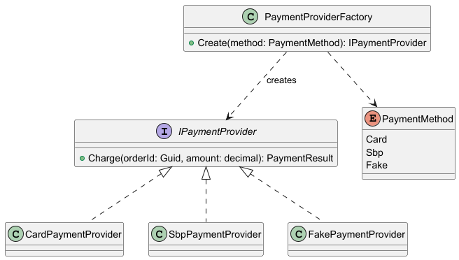

#### Фрагмент кода
```csharp
public enum PaymentMethod { Card, Sbp, Fake }

public interface IPaymentProvider
{
    PaymentResult Charge(Guid orderId, decimal amount);
}

public sealed class CardPaymentProvider : IPaymentProvider
{
    public PaymentResult Charge(Guid orderId, decimal amount) =>
        PaymentResult.Success("card_tx_" + orderId);
}

public sealed class SbpPaymentProvider : IPaymentProvider
{
    public PaymentResult Charge(Guid orderId, decimal amount) =>
        PaymentResult.Success("sbp_tx_" + orderId);
}

public sealed class PaymentProviderFactory
{
    public IPaymentProvider Create(PaymentMethod method) => method switch
    {
        PaymentMethod.Card => new CardPaymentProvider(),
        PaymentMethod.Sbp  => new SbpPaymentProvider(),
        PaymentMethod.Fake => new FakePaymentProvider(),
        _ => throw new NotSupportedException($"Method '{method}' is not supported")
    };
}

public sealed class FakePaymentProvider : IPaymentProvider
{
    public PaymentResult Charge(Guid orderId, decimal amount) =>
        PaymentResult.Success("fake_tx_" + orderId);
}

public record PaymentResult(bool IsSuccess, string ProviderRef)
{
    public static PaymentResult Success(string providerRef) => new(true, providerRef);
}
```

### GoF: Abstract Factory

- **Общее назначение:** предоставляет интерфейс для создания **семейств взаимосвязанных объектов** (без указания их конкретных классов). Позволяет переключать “набор реализаций” целиком (например, Prod vs Test), не меняя клиентский код.
- **Назначение в нашем кейсе:** в зависимости от окружения (Production/Sandbox) система должна использовать разные интеграции: реальные платёжные/уведомления в проде и “заглушки” в тесте. Чтобы `CheckoutFacade` не знал о конкретных SDK/классах, он получает `IIntegrationFactory`, которая создаёт согласованный набор клиентов.

#### UML (PlantUML)

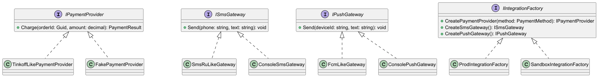

#### Фрагмент кода
```csharp
public interface ISmsGateway { void Send(string phone, string text); }
public interface IPushGateway { void Send(string deviceId, string text); }
public interface IPaymentProvider { PaymentResult Charge(Guid orderId, decimal amount); }

public interface IIntegrationFactory
{
    IPaymentProvider CreatePaymentProvider(PaymentMethod method);
    ISmsGateway CreateSmsGateway();
    IPushGateway CreatePushGateway();
}

public sealed class ProdIntegrationFactory : IIntegrationFactory
{
    public IPaymentProvider CreatePaymentProvider(PaymentMethod method) =>
        method == PaymentMethod.Card ? new TinkoffLikePaymentProvider()
                                     : throw new NotSupportedException();

    public ISmsGateway CreateSmsGateway() => new SmsRuLikeGateway();
    public IPushGateway CreatePushGateway() => new FcmLikeGateway();
}

public sealed class SandboxIntegrationFactory : IIntegrationFactory
{
    public IPaymentProvider CreatePaymentProvider(PaymentMethod method) => new FakePaymentProvider();
    public ISmsGateway CreateSmsGateway() => new ConsoleSmsGateway();
    public IPushGateway CreatePushGateway() => new ConsolePushGateway();
}

public sealed class CheckoutFacade
{
    private readonly IIntegrationFactory _integrations;
    public CheckoutFacade(IIntegrationFactory integrations) => _integrations = integrations;

    public void NotifyOrderCreated(string phone)
        => _integrations.CreateSmsGateway().Send(phone, "Заказ создан");
}
```

### GoF: Builder

- **Общее назначение:** отделяет **конструирование сложного объекта** от его представления, позволяя поэтапно собирать разные варианты объекта одним и тем же процессом сборки.
- **Назначение в нашем кейсе:** заказ (`Order`) собирается из нескольких частей: позиции, тип получения (самовывоз/доставка), адрес доставки, применение промокода, пересчёт итоговой суммы. Чтобы не плодить длинные конструкторы и не держать сборочную логику в контроллере/фасаде, используем `OrderBuilder`.

#### UML (PlantUML)

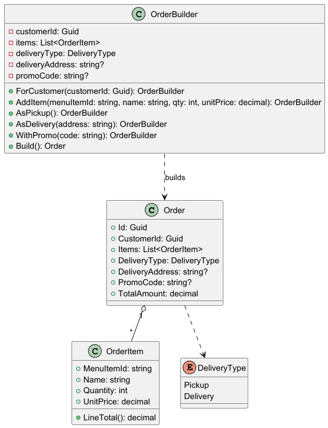

#### Фрагмент кода
```csharp
public enum DeliveryType { Pickup, Delivery }

public sealed class Order
{
    public Guid Id { get; init; } = Guid.NewGuid();
    public Guid CustomerId { get; init; }
    public List<OrderItem> Items { get; init; } = new();
    public DeliveryType DeliveryType { get; init; }
    public string? DeliveryAddress { get; init; }
    public string? PromoCode { get; init; }
    public decimal TotalAmount { get; init; }
}

public record OrderItem(string MenuItemId, string Name, int Quantity, decimal UnitPrice)
{
    public decimal LineTotal() => Quantity * UnitPrice;
}

public sealed class OrderBuilder
{
    private Guid _customerId;
    private readonly List<OrderItem> _items = new();
    private DeliveryType _deliveryType = DeliveryType.Pickup;
    private string? _deliveryAddress;
    private string? _promoCode;

    public OrderBuilder ForCustomer(Guid customerId) { _customerId = customerId; return this; }

    public OrderBuilder AddItem(string menuItemId, string name, int qty, decimal unitPrice)
    { _items.Add(new(menuItemId, name, qty, unitPrice)); return this; }

    public OrderBuilder AsPickup() { _deliveryType = DeliveryType.Pickup; _deliveryAddress = null; return this; }
    public OrderBuilder AsDelivery(string address) { _deliveryType = DeliveryType.Delivery; _deliveryAddress = address; return this; }

    public OrderBuilder WithPromo(string code) { _promoCode = code; return this; }

    public Order Build()
    {
        if (_customerId == Guid.Empty) throw new InvalidOperationException("CustomerId is required");
        if (_items.Count == 0) throw new InvalidOperationException("At least one item is required");
        if (_deliveryType == DeliveryType.Delivery && string.IsNullOrWhiteSpace(_deliveryAddress))
            throw new InvalidOperationException("Delivery address is required");

        var subtotal = _items.Sum(i => i.LineTotal());
        var discount = _promoCode is null ? 0m : subtotal * 0.10m; // демо-правило
        var deliveryFee = _deliveryType == DeliveryType.Delivery ? 150m : 0m;

        return new Order
        {
            CustomerId = _customerId,
            Items = _items.ToList(),
            DeliveryType = _deliveryType,
            DeliveryAddress = _deliveryAddress,
            PromoCode = _promoCode,
            TotalAmount = subtotal - discount + deliveryFee
        };
    }
}
```

### Структурные шаблоны

### GoF: Adapter

- **Общее назначение:** преобразует интерфейс одного класса в интерфейс, ожидаемый клиентом. Позволяет совместить несовместимые интерфейсы без изменения клиентского кода и без изменения внешней библиотеки.
- **Назначение в нашем кейсе:** внешние SDK (SMS-провайдер, платёжный шлюз) имеют свои классы/методы/форматы. Мы хотим, чтобы прикладной код работал с едиными интерфейсами (`ISmsGateway`, `IPaymentProvider`). Поэтому делаем адаптеры, которые “переводят” вызовы на внешний API.

#### UML (PlantUML)

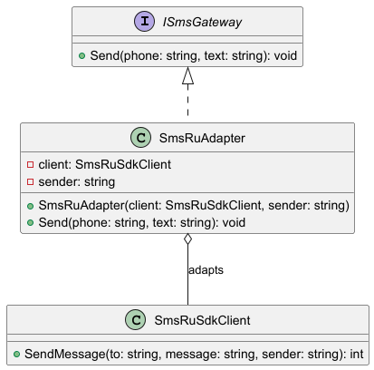

#### Фрагмент кода
```csharp
public interface ISmsGateway
{
    void Send(string phone, string text);
}

// имитация "чужого" SDK, менять его нельзя
public sealed class SmsRuSdkClient
{
    public int SendMessage(string to, string message, string sender)
    {
        // возвращает код результата (0 - ok, иначе ошибка)
        return 0;
    }
}

// Adapter: приводим чужой интерфейс к нашему ISmsGateway
public sealed class SmsRuAdapter : ISmsGateway
{
    private readonly SmsRuSdkClient _client;
    private readonly string _sender;

    public SmsRuAdapter(SmsRuSdkClient client, string sender)
    {
        _client = client;
        _sender = sender;
    }

    public void Send(string phone, string text)
    {
        var resultCode = _client.SendMessage(to: phone, message: text, sender: _sender);
        if (resultCode != 0)
            throw new InvalidOperationException($"SMS provider error, code={resultCode}");
    }
}
```

### GoF: Facade

- **Общее назначение:** предоставляет унифицированный (упрощённый) интерфейс к набору интерфейсов подсистемы. Скрывает сложность и уменьшает связность клиентского кода с внутренними компонентами.
- **Назначение в нашем кейсе:** операция “оформить заказ” затрагивает несколько подсистем: сборку заказа, расчёт итоговой суммы, сохранение, оплату, отправку уведомлений и публикацию события. Чтобы контроллер/API не оркестрировал десяток вызовов и не знал деталей, вводим `CheckoutFacade`.

#### UML (PlantUML)

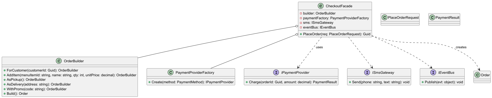

#### Фрагмент кода
```csharp
public record PlaceOrderRequest(
    Guid CustomerId,
    string Phone,
    List<(string MenuItemId, string Name, int Qty, decimal UnitPrice)> Items,
    DeliveryType DeliveryType,
    string? DeliveryAddress,
    string? PromoCode,
    PaymentMethod PaymentMethod);

public interface IEventBus { void Publish(object evt); }

public sealed class CheckoutFacade
{
    private readonly OrderBuilder _builder;
    private readonly PaymentProviderFactory _paymentFactory;
    private readonly ISmsGateway _sms;
    private readonly IEventBus _eventBus;

    public CheckoutFacade(OrderBuilder builder, PaymentProviderFactory paymentFactory, ISmsGateway sms, IEventBus eventBus)
    {
        _builder = builder;
        _paymentFactory = paymentFactory;
        _sms = sms;
        _eventBus = eventBus;
    }

    public Guid PlaceOrder(PlaceOrderRequest req)
    {
        var b = _builder.ForCustomer(req.CustomerId);
        foreach (var i in req.Items)
            b = b.AddItem(i.MenuItemId, i.Name, i.Qty, i.UnitPrice);

        b = req.DeliveryType == DeliveryType.Delivery ? b.AsDelivery(req.DeliveryAddress!) : b.AsPickup();
        if (!string.IsNullOrWhiteSpace(req.PromoCode)) b = b.WithPromo(req.PromoCode!);

        var order = b.Build();

        var provider = _paymentFactory.Create(req.PaymentMethod);
        var payment = provider.Charge(order.Id, order.TotalAmount);

        _sms.Send(req.Phone, $"Заказ {order.Id} создан. Оплата: {payment.ProviderRef}");
        _eventBus.Publish(new { Type = "OrderCreated", OrderId = order.Id });

        return order.Id;
    }
}
```

### GoF: Decorator

- **Общее назначение:** динамически добавляет объекту новые обязанности, “оборачивая” его в объект-декоратор с тем же интерфейсом. Альтернатива наследованию для расширения поведения.
- **Назначение в нашем кейсе:** хотим добавить логирование/ретраи/метрики для отправки SMS или вызовов платёжного провайдера, **не меняя** реализацию `SmsRuAdapter`/`IPaymentProvider` и не плодя подклассы под каждую комбинацию.

#### UML (PlantUML)

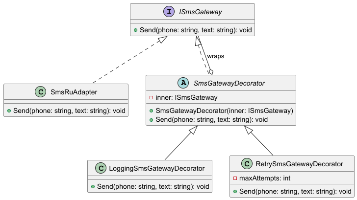

#### Фрагмент кода
```csharp
public interface ISmsGateway
{
    void Send(string phone, string text);
}

public abstract class SmsGatewayDecorator : ISmsGateway
{
    protected readonly ISmsGateway Inner;
    protected SmsGatewayDecorator(ISmsGateway inner) => Inner = inner;
    public virtual void Send(string phone, string text) => Inner.Send(phone, text);
}

public sealed class LoggingSmsGatewayDecorator : SmsGatewayDecorator
{
    public LoggingSmsGatewayDecorator(ISmsGateway inner) : base(inner) { }

    public override void Send(string phone, string text)
    {
        Console.WriteLine($"[sms] sending to={phone}, len={text.Length}");
        Inner.Send(phone, text);
        Console.WriteLine($"[sms] sent to={phone}");
    }
}

public sealed class RetrySmsGatewayDecorator : SmsGatewayDecorator
{
    private readonly int _maxAttempts;
    public RetrySmsGatewayDecorator(ISmsGateway inner, int maxAttempts = 3) : base(inner)
        => _maxAttempts = maxAttempts;

    public override void Send(string phone, string text)
    {
        for (var attempt = 1; attempt <= _maxAttempts; attempt++)
        {
            try { Inner.Send(phone, text); return; }
            catch when (attempt < _maxAttempts) { /* backoff could be here */ }
        }
    }
}

// пример композиции:
ISmsGateway sms = new RetrySmsGatewayDecorator(
    new LoggingSmsGatewayDecorator(new SmsRuAdapter(new SmsRuSdkClient(), sender: "SHOP")),
    maxAttempts: 3);
```

### GoF: Proxy

- **Общее назначение:** предоставляет объект-заместитель, который контролирует доступ к реальному объекту (lazy-init, кеширование, контроль доступа, лимитирование, логирование и т.п.), сохраняя тот же интерфейс.
- **Назначение в нашем кейсе:** получение меню/информации о позициях может ходить во внешний сервис или БД и быть дорогим. Мы хотим кешировать результат на короткое время и снижать нагрузку, не меняя клиентский код. Для этого вводим `CachedMenuClientProxy : IMenuClient`.

#### UML (PlantUML)

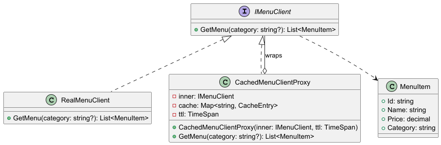

#### Фрагмент кода
```csharp
public record MenuItem(string Id, string Name, decimal Price, string Category);

public interface IMenuClient
{
    IReadOnlyList<MenuItem> GetMenu(string? category);
}

public sealed class RealMenuClient : IMenuClient
{
    public IReadOnlyList<MenuItem> GetMenu(string? category)
    {
        // имитация дорогого вызова: HTTP/DB
        return new List<MenuItem>
        {
            new("item-001", "Сэндвич BLT", 350m, "sandwich"),
            new("item-015", "Кола 0.5л", 120m, "drink")
        }.Where(x => category is null || x.Category == category).ToList();
    }
}

public sealed class CachedMenuClientProxy : IMenuClient
{
    private readonly IMenuClient _inner;
    private readonly TimeSpan _ttl;

    private readonly Dictionary<string, (DateTime cachedAt, IReadOnlyList<MenuItem> data)> _cache = new();

    public CachedMenuClientProxy(IMenuClient inner, TimeSpan ttl)
    { _inner = inner; _ttl = ttl; }

    public IReadOnlyList<MenuItem> GetMenu(string? category)
    {
        var key = category ?? "__all__";
        if (_cache.TryGetValue(key, out var entry) && DateTime.UtcNow - entry.cachedAt < _ttl)
            return entry.data;

        var fresh = _inner.GetMenu(category);
        _cache[key] = (DateTime.UtcNow, fresh);
        return fresh;
    }
}

// пример использования (клиентский код не знает про кеш)
IMenuClient menuClient = new CachedMenuClientProxy(new RealMenuClient(), ttl: TimeSpan.FromMinutes(5));
var drinks = menuClient.GetMenu("drink");
```

### Поведенческие шаблоны

### GoF: Strategy

- **Общее назначение:** определяет семейство алгоритмов, инкапсулирует каждый из них и делает их взаимозаменяемыми. Позволяет выбирать алгоритм во время выполнения, не изменяя код клиента.
- **Назначение в нашем кейсе:** расчёт скидки/итоговой суммы может зависеть от условий (нет скидки / промокод / лояльность). Чтобы не разрастался `if/else` в расчёте цены и можно было добавлять новые правила без правок существующего кода, используем стратегии скидок.

#### UML (PlantUML)

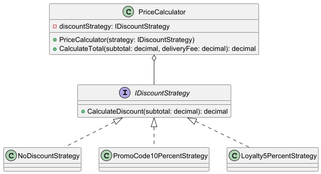

#### Фрагмент кода
```csharp
public interface IDiscountStrategy
{
    decimal CalculateDiscount(decimal subtotal);
}

public sealed class NoDiscountStrategy : IDiscountStrategy
{
    public decimal CalculateDiscount(decimal subtotal) => 0m;
}

public sealed class PromoCode10PercentStrategy : IDiscountStrategy
{
    public decimal CalculateDiscount(decimal subtotal) => subtotal * 0.10m;
}

public sealed class Loyalty5PercentStrategy : IDiscountStrategy
{
    public decimal CalculateDiscount(decimal subtotal) => subtotal * 0.05m;
}

public sealed class PriceCalculator
{
    private readonly IDiscountStrategy _discountStrategy;
    public PriceCalculator(IDiscountStrategy discountStrategy) => _discountStrategy = discountStrategy;

    public decimal CalculateTotal(decimal subtotal, decimal deliveryFee)
    {
        var discount = _discountStrategy.CalculateDiscount(subtotal);
        if (discount < 0 || discount > subtotal) throw new InvalidOperationException("Invalid discount");
        return subtotal - discount + deliveryFee;
    }
}

// пример выбора стратегии (условно)
IDiscountStrategy strategy = hasPromoCode ? new PromoCode10PercentStrategy()
                        : isLoyalCustomer ? new Loyalty5PercentStrategy()
                        : new NoDiscountStrategy();

var total = new PriceCalculator(strategy).CalculateTotal(subtotal: 1000m, deliveryFee: 150m);
```

### GoF: State

- **Общее назначение:** позволяет объекту изменять своё поведение при изменении внутреннего состояния. Внешне это выглядит так, будто объект сменил свой класс.
- **Назначение в нашем кейсе:** у заказа есть жизненный цикл (`Pending → Preparing → InDelivery → Completed/Cancelled`). В каждом статусе разные правила: где-то можно менять состав, где-то нельзя; где-то можно отменять, где-то нельзя. Чтобы не держать большой `switch(order.Status)` во всех методах, выносим поведение в классы состояний.

#### UML (PlantUML)

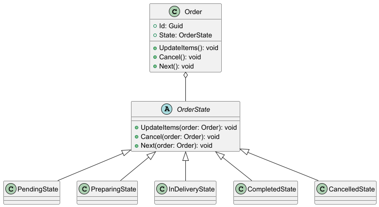

#### Фрагмент кода
```csharp
public sealed class Order
{
    public Guid Id { get; } = Guid.NewGuid();
    public OrderState State { get; private set; } = new PendingState();

    public void UpdateItems() => State.UpdateItems(this);
    public void Cancel()      => State.Cancel(this);
    public void Next()        => State.Next(this);

    internal void SetState(OrderState newState) => State = newState;
}

public abstract class OrderState
{
    public virtual void UpdateItems(Order order) =>
        throw new InvalidOperationException($"Cannot update items in {GetType().Name}");

    public virtual void Cancel(Order order) =>
        throw new InvalidOperationException($"Cannot cancel in {GetType().Name}");

    public virtual void Next(Order order) =>
        throw new InvalidOperationException($"No next state from {GetType().Name}");
}

public sealed class PendingState : OrderState
{
    public override void UpdateItems(Order order) { /* ok: change cart */ }

    public override void Cancel(Order order) => order.SetState(new CancelledState());

    public override void Next(Order order) => order.SetState(new PreparingState());
}

public sealed class PreparingState : OrderState
{
    public override void Cancel(Order order) => order.SetState(new CancelledState());
    public override void Next(Order order) => order.SetState(new InDeliveryState());
}

public sealed class InDeliveryState : OrderState
{
    public override void Next(Order order) => order.SetState(new CompletedState());
}

public sealed class CompletedState : OrderState { }
public sealed class CancelledState : OrderState { }
```


### GoF: Command

- **Общее назначение:** инкапсулирует запрос как объект, позволяя параметризовать клиентов запросами, ставить запросы в очередь, логировать, поддерживать отмену/повтор.
- **Назначение в нашем кейсе:** операции над заказом (создать/обновить/отменить) удобно представить как команды. Тогда контроллер вызывает единый `CommandDispatcher`, а сама бизнес-логика живёт в обработчиках; команды можно повторять при сбоях, логировать и (в расширении) отправлять на асинхронную обработку.

#### UML (PlantUML)

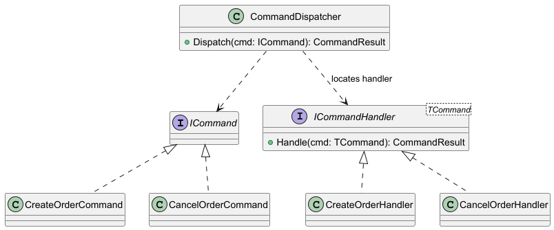

#### Фрагмент кода
```csharp
public interface ICommand { }

public record CreateOrderCommand(Guid CustomerId, string Phone) : ICommand;
public record CancelOrderCommand(Guid OrderId, string Reason) : ICommand;

public record CommandResult(bool IsSuccess, string Message, Guid? EntityId = null);

public interface ICommandHandler<in TCommand> where TCommand : ICommand
{
    CommandResult Handle(TCommand cmd);
}

public sealed class CreateOrderHandler : ICommandHandler<CreateOrderCommand>
{
    public CommandResult Handle(CreateOrderCommand cmd)
    {
        // демо: "создали заказ"
        var orderId = Guid.NewGuid();
        return new CommandResult(true, "Order created", orderId);
    }
}

public sealed class CancelOrderHandler : ICommandHandler<CancelOrderCommand>
{
    public CommandResult Handle(CancelOrderCommand cmd)
    {
        // демо: "отменили заказ"
        return new CommandResult(true, $"Order {cmd.OrderId} cancelled: {cmd.Reason}", cmd.OrderId);
    }
}

public sealed class CommandDispatcher
{
    public CommandResult Dispatch(ICommand cmd) => cmd switch
    {
        CreateOrderCommand c => new CreateOrderHandler().Handle(c),
        CancelOrderCommand c => new CancelOrderHandler().Handle(c),
        _ => throw new NotSupportedException($"Unknown command type {cmd.GetType().Name}")
    };
}
```

### GoF: Observer / Publisher–Subscriber

- **Общее назначение:** определяет зависимость “один-ко-многим”: при изменении состояния субъекта все зависимые наблюдатели уведомляются и обновляются автоматически.
- **Назначение в нашем кейсе:** когда заказ создан/оплачен/изменил статус, нужно выполнить реакции в разных местах (уведомить клиента, обновить аналитику, запустить доставку). Чтобы `CheckoutFacade` не вызывал всё напрямую и не рос по зависимостям, публикуем событие в `IEventBus`, а обработчики подписываются на нужные события.

#### UML (PlantUML)

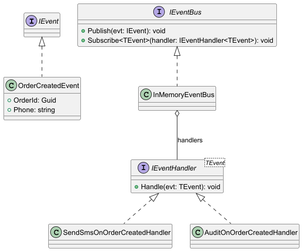

#### Фрагмент кода
```csharp
public interface IEvent { }

public record OrderCreatedEvent(Guid OrderId, string Phone) : IEvent;

public interface IEventHandler<in TEvent> where TEvent : IEvent
{
    void Handle(TEvent evt);
}

public interface IEventBus
{
    void Publish(IEvent evt);
    void Subscribe<TEvent>(IEventHandler<TEvent> handler) where TEvent : IEvent;
}

public sealed class InMemoryEventBus : IEventBus
{
    private readonly Dictionary<Type, List<object>> _handlers = new();

    public void Subscribe<TEvent>(IEventHandler<TEvent> handler) where TEvent : IEvent
    {
        var t = typeof(TEvent);
        if (!_handlers.ContainsKey(t)) _handlers[t] = new List<object>();
        _handlers[t].Add(handler);
    }

    public void Publish(IEvent evt)
    {
        if (!_handlers.TryGetValue(evt.GetType(), out var list)) return;
        foreach (var h in list.Cast<IEventHandler<IEvent>>())
            h.Handle(evt);
    }
}

public sealed class SendSmsOnOrderCreatedHandler : IEventHandler<OrderCreatedEvent>
{
    private readonly ISmsGateway _sms;
    public SendSmsOnOrderCreatedHandler(ISmsGateway sms) => _sms = sms;

    public void Handle(OrderCreatedEvent evt) => _sms.Send(evt.Phone, $"Заказ {evt.OrderId} создан");
}
```


### GoF: Chain of Responsibility

- **Общее назначение:** позволяет передавать запрос последовательно по цепочке обработчиков. Каждый обработчик либо обрабатывает запрос, либо передаёт дальше. Убирает жёсткую привязку отправителя запроса к конкретному обработчику и упрощает добавление/перестановку шагов обработки.
- **Назначение в нашем кейсе:** перед созданием заказа нужно выполнить набор проверок (валидность входных данных, наличие товаров, бизнес-ограничения). Чтобы не делать монолитный метод и легко добавлять новые проверки, строим цепочку обработчиков.

#### UML (PlantUML)

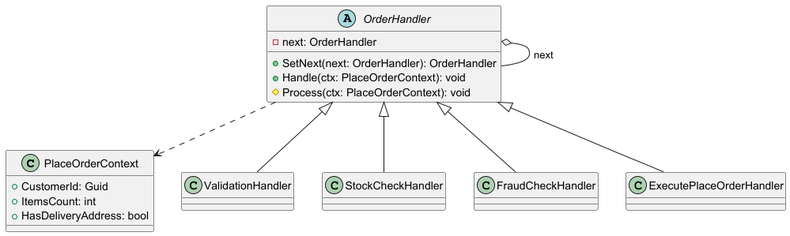

#### Фрагмент кода
```csharp
public sealed record PlaceOrderContext(Guid CustomerId, int ItemsCount, bool HasDeliveryAddress);

public abstract class OrderHandler
{
    private OrderHandler? _next;

    public OrderHandler SetNext(OrderHandler next)
    {
        _next = next;
        return next;
    }

    public void Handle(PlaceOrderContext ctx)
    {
        Process(ctx);
        _next?.Handle(ctx);
    }

    protected abstract void Process(PlaceOrderContext ctx);
}

public sealed class ValidationHandler : OrderHandler
{
    protected override void Process(PlaceOrderContext ctx)
    {
        if (ctx.CustomerId == Guid.Empty) throw new InvalidOperationException("CustomerId is required");
        if (ctx.ItemsCount <= 0) throw new InvalidOperationException("At least one item is required");
    }
}

public sealed class StockCheckHandler : OrderHandler
{
    protected override void Process(PlaceOrderContext ctx)
    {
        var inStock = true; // демо: якобы проверили наличие
        if (!inStock) throw new InvalidOperationException("Some items are out of stock");
    }
}

public sealed class ExecutePlaceOrderHandler : OrderHandler
{
    protected override void Process(PlaceOrderContext ctx)
    {
        // демо: здесь была бы реальная логика создания заказа
        Console.WriteLine("Order placed");
    }
}

// пример сборки цепочки:
var chain = new ValidationHandler();
chain.SetNext(new StockCheckHandler())
     .SetNext(new ExecutePlaceOrderHandler());

chain.Handle(new PlaceOrderContext(Guid.NewGuid(), itemsCount: 2, hasDeliveryAddress: false));
```


## Шаблоны проектирования GRASP

### Роли (обязанности) классов

#### 1) GRASP Controller

- Проблема: если контроллер (ASP.NET endpoint) содержит бизнес-логику (расчёт цены, вызовы оплат/уведомлений), то он быстро разрастается, становится трудно тестируемым и переиспользуемым.
- Решение: `OrderController` принимает HTTP-запрос, валидирует форму (минимально) и делегирует выполнение прикладному слою (`CheckoutFacade` или `CommandDispatcher`).
- Пример кода:

```csharp
public sealed class OrderController
{
    private readonly CheckoutFacade _checkout;

    public OrderController(CheckoutFacade checkout) => _checkout = checkout;

    // POST /api/v1/orders
    public Guid PlaceOrder(PlaceOrderRequest request)
    {
        if (request.CustomerId == Guid.Empty)
            throw new InvalidOperationException("customerId is required");

        // бизнес-логика не здесь — только делегирование
        return _checkout.PlaceOrder(request);
    }
}
```

- Результаты:
- Контроллер тонкий и стабильный при изменении бизнес-правил.
- Проще писать unit-тесты: тестируем фасад/команды без HTTP.
- Связь с другими паттернами:
- Facade (контроллер делегирует фасаду).
- Command (контроллер мог бы диспатчить команды вместо прямого вызова).

---

#### 2) GRASP Creator

- Проблема: непонятно, кто “правильно” должен создавать `Order`, чтобы не нарушать инварианты (пустой заказ, нет адреса при доставке и т.п.).
- Решение: создавать `Order` поручается классу, который агрегирует данные и “знает, как собрать” объект — `OrderBuilder` (создатель сложного объекта).
- Пример кода:

```csharp
public sealed class OrderFactory // Creator
{
    public Order CreateFrom(PlaceOrderRequest req)
    {
        var b = new OrderBuilder().ForCustomer(req.CustomerId);

        foreach (var i in req.Items)
            b.AddItem(i.MenuItemId, i.Name, i.Qty, i.UnitPrice);

        if (req.DeliveryType == DeliveryType.Delivery)
            b.AsDelivery(req.DeliveryAddress!);
        else
            b.AsPickup();

        if (!string.IsNullOrWhiteSpace(req.PromoCode))
            b.WithPromo(req.PromoCode!);

        return b.Build();
    }
}
```

- Результаты:
- Сборка объекта централизована, инварианты проще контролировать.
- Уменьшается дублирование “сборочного” кода.
- Связь с другими паттернами:
- Builder (реализация поэтапной сборки).
- Facade (использует Creator для создания заказа).

---

#### 3) GRASP Information Expert

- Проблема: расчёт суммы заказа часто “размазывают” по сервисам/контроллерам, хотя данные (items/цены) принадлежат самому заказу.
- Решение: ответственность “посчитать subtotal” отдаём сущности, у которой есть вся информация — `Order`/`OrderItem`.
- Пример кода:

```csharp
public sealed class Order
{
    public Guid Id { get; init; } = Guid.NewGuid();
    public List<OrderItem> Items { get; init; } = new();

    public decimal Subtotal() => Items.Sum(i => i.LineTotal());
}

public record OrderItem(string MenuItemId, string Name, int Quantity, decimal UnitPrice)
{
    public decimal LineTotal() => Quantity * UnitPrice;
}
```

- Результаты:
- Логика ближе к данным, меньше параметров “протаскиваем” по вызовам.
- Повышается согласованность модели: поведение и данные рядом.
- Связь с другими паттернами:
- Strategy (скидки могут считаться стратегиями, но базовый subtotal — эксперт в `Order`).
- State (правила допустимых действий зависят от состояния заказа, но данные остаются в `Order`).

---

#### 4) GRASP Pure Fabrication

- Проблема: некоторые обязанности не “естественны” для доменных сущностей (например, сохранение в БД, HTTP-вызовы внешних провайдеров). Если за это отвечают `Order/Customer`, модель загрязняется инфраструктурой.
- Решение: вводим искусственный сервис/класс, которого “нет в предметной области”, но он нужен архитектурно — например `OrderRepository` и `PaymentGatewayClient`.
- Пример кода:

```csharp
public interface IOrderRepository
{
    void Save(Order order);
    Order? Get(Guid id);
}

public sealed class InMemoryOrderRepository : IOrderRepository // Pure Fabrication
{
    private readonly Dictionary<Guid, Order> _db = new();

    public void Save(Order order) => _db[order.Id] = order;
    public Order? Get(Guid id) => _db.TryGetValue(id, out var o) ? o : null;
}
```

- Результаты:
- Доменные классы остаются “чистыми”.
- Инфраструктуру проще заменить (in-memory → EF Core/PostgreSQL).
- Связь с другими паттернами:
- Protected Variations (репозиторий как барьер изменений).
- Adapter/Decorator/Proxy (аналогично изолируют инфраструктурные детали).

---

#### 5) GRASP Indirection

- Проблема: если `CheckoutFacade` напрямую вызывает SMS/Push/Analytics/Delivery, то растёт связность и сложность изменения/расширения реакций на события.
- Решение: добавить посредника — `IEventBus` (или брокер сообщений). Фасад публикует события, а подписчики реагируют независимо.
- Пример кода:

```csharp
public interface IEventBus
{
    void Publish(IEvent evt);
}

public sealed class CheckoutFacade
{
    private readonly IEventBus _bus;
    public CheckoutFacade(IEventBus bus) => _bus = bus;

    public Guid PlaceOrder(PlaceOrderRequest req)
    {
        var orderId = Guid.NewGuid(); // демо
        _bus.Publish(new OrderCreatedEvent(orderId, req.Phone));
        return orderId;
    }
}
```

- Результаты:
- Снижается прямое число зависимостей между модулями.
- Добавление новой реакции (например, “писать в аудит”) не требует менять фасад.
- Связь с другими паттернами:
- Observer (подписчики на события).
- Facade (фасад упрощает сценарий, посредник разрывает зависимости внутри).


### Принципы разработки

#### 1) Low Coupling (Слабая связность)

- Проблема: при прямых зависимостях от конкретных классов (например, `SmsRuSdkClient`) изменение провайдера вызывает каскад правок.
- Решение: зависеть от абстракций (`ISmsGateway`, `IPaymentProvider`) и внедрять реализации через фабрики/DI.
- Пример кода:

```csharp
public sealed class NotificationService
{
    private readonly ISmsGateway _sms;
    public NotificationService(ISmsGateway sms) => _sms = sms;

    public void SendOrderCreated(string phone, Guid orderId)
        => _sms.Send(phone, $"Заказ {orderId} создан");
}
```

- Результаты:
- Меньше причин менять код при смене интеграций.
- Упрощается тестирование (можно подставить fake).
- Связь с другими паттернами:
- Adapter (реальный провайдер прячется за адаптером).
- Abstract Factory (переключение “семейств” реализаций).

---

#### 2) High Cohesion (Высокая связность/согласованность внутри класса)

- Проблема: “комбайн”-класс, который и валидирует, и собирает заказ, и списывает оплату, и шлёт SMS — плохо поддерживается.
- Решение: держать классы узкими по ответственности: `OrderBuilder` только строит, `PriceCalculator` только считает, `CheckoutFacade` только оркестрирует.
- Пример кода:

```csharp
public sealed class PriceCalculator
{
    public decimal DeliveryFee(DeliveryType type) => type == DeliveryType.Delivery ? 150m : 0m;
}

public sealed class CheckoutFacade
{
    private readonly PriceCalculator _calc;
    public CheckoutFacade(PriceCalculator calc) => _calc = calc;

    public decimal PreviewDeliveryFee(DeliveryType type) => _calc.DeliveryFee(type);
}
```

- Результаты:
- Изменения локализуются (меняем расчёт доставки — правим `PriceCalculator`).
- Компоненты проще читать и тестировать.
- Связь с другими паттернами:
- Strategy (алгоритмы выделяются в отдельные классы, повышая cohesion каждого).
- Chain of Responsibility (каждый handler делает одну проверку).

---

#### 3) Protected Variations (Защита от вариаций)

- Проблема: вариативные части системы (платёжные провайдеры, каналы уведомлений, скидки) меняются чаще всего.
- Решение: ставим “барьеры” в виде интерфейсов и фабрик; клиентский код знает только контракт.
- Пример кода:

```csharp
public interface IPaymentProvider
{
    PaymentResult Charge(Guid orderId, decimal amount);
}

// барьер вариативности — фабрика выбора реализации
public sealed class PaymentProviderFactory
{
    public IPaymentProvider Create(PaymentMethod method) => method switch
    {
        PaymentMethod.Card => new CardPaymentProvider(),
        PaymentMethod.Sbp  => new SbpPaymentProvider(),
        _ => throw new NotSupportedException()
    };
}
```

- Результаты:
- Можно добавлять новые варианты с минимальными изменениями.
- Локализуется точка изменений (обычно фабрика/регистрация DI).
- Связь с другими паттернами:
- Factory Method / Abstract Factory (реализация PV на практике).
- Strategy (PV для алгоритмов).

### Свойство программы (цель)

#### Расширяемость (Extensibility)

- Проблема: система должна легко расширяться (например, добавить новый платёжный провайдер) без переписывания основного сценария оформления заказа.
- Решение: использовать абстракции + фабрики/стратегии/адаптеры, чтобы новый функционал добавлялся “приклеиванием” нового класса и минимальной правкой точки выбора.
- Пример кода (добавление нового провайдера без изменения `CheckoutFacade`):

```csharp
public sealed class NewBankPaymentProvider : IPaymentProvider
{
    public PaymentResult Charge(Guid orderId, decimal amount) =>
        PaymentResult.Success("newbank_tx_" + orderId);
}

// изменяется только фабрика (точка вариативности)
public sealed class PaymentProviderFactory
{
    public IPaymentProvider Create(PaymentMethod method) => method switch
    {
        PaymentMethod.Card    => new CardPaymentProvider(),
        PaymentMethod.Sbp     => new SbpPaymentProvider(),
        PaymentMethod.NewBank => new NewBankPaymentProvider(),
        _ => throw new NotSupportedException()
    };
}

public enum PaymentMethod { Card, Sbp, NewBank }
```

- Результаты:
- Новые интеграции добавляются предсказуемо и локально.
- Снижается риск регрессий в “ядре” сценария.
- Связь с другими паттернами:
- Adapter (подключение нового SDK через адаптер).
- Abstract Factory (переключение набора интеграций под окружение).
- Protected Variations (как GRASP-принцип, обеспечивающий расширяемость).
    
